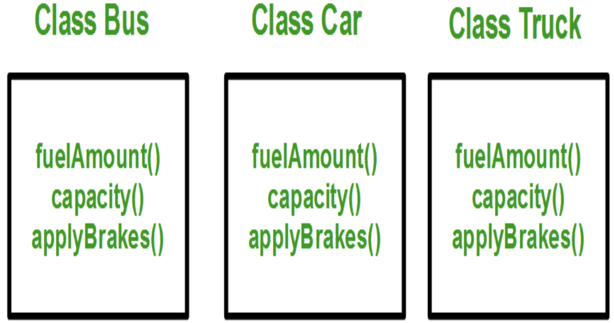
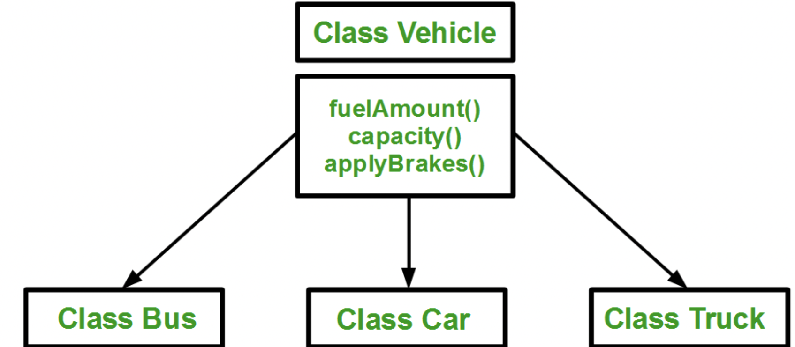
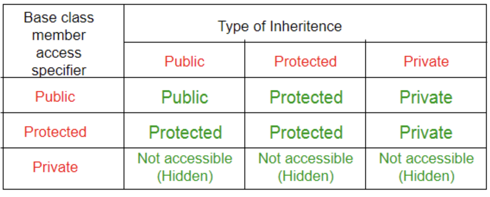
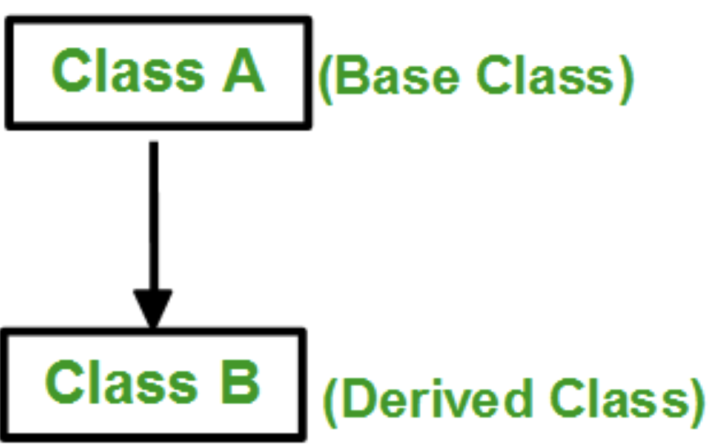
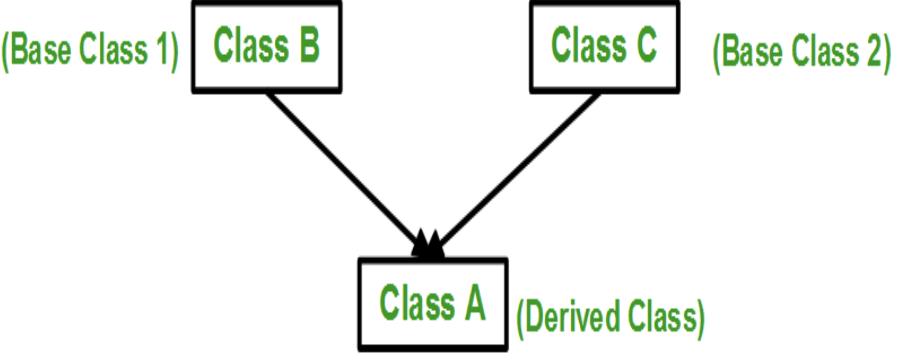
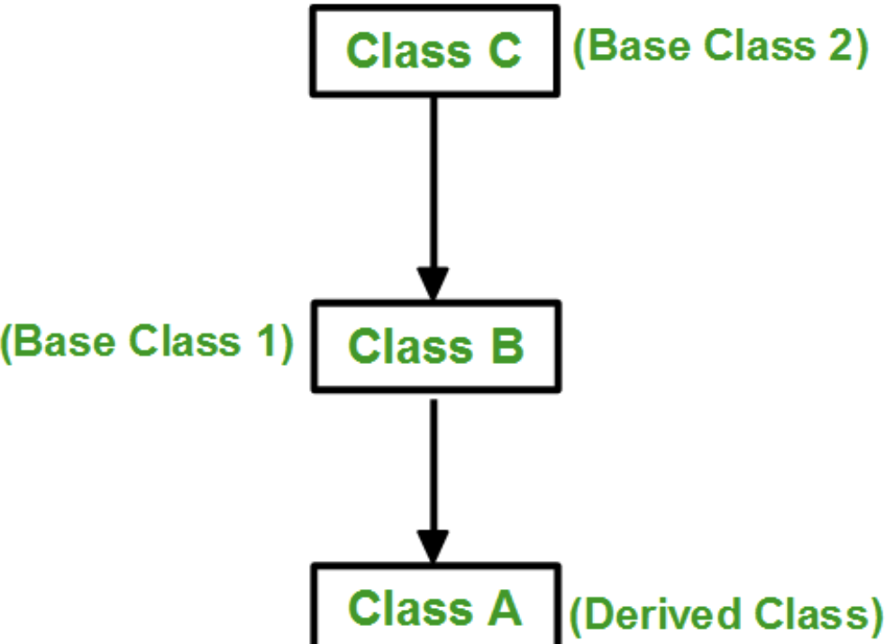
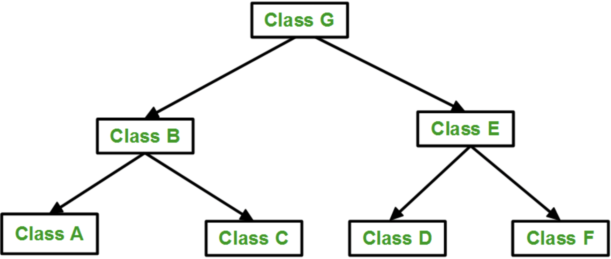
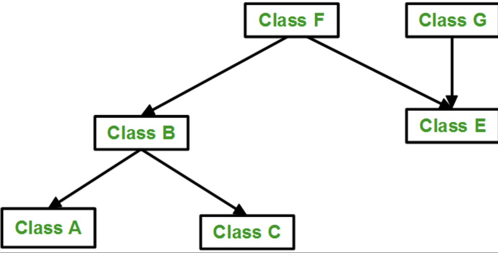

# Lab 9:  Class structure in C++

Welcome to the ninth session of  CSC 200 lab! This will familiarize you with **Inheritance** and **Overloading** in class as well as give you some experience in their proper use. **Be sure to read and follow all instructions unless otherwise specified.**  You'll find the table of contents for this lab below.

1. [Introduction to Inheritance  In C++](#part-1-Introduction-to-Inheritance-In-C++)
1. [Introduction to Overloading In C++](#part-2-Introduction-to-Overloading-In-C++)
3. [Exercises](#part-3-exercises)

## Part 1. Introduction to Inheritance In C++

One of the most important concepts in object-oriented programming is that of inheritance. Inheritance allows us to define a class in terms of another class, which makes it easier to create and maintain an application. This also provides an opportunity to reuse the code functionality and fast implementation time.

When creating a class, instead of writing completely new data members and member functions, the programmer can designate that the new class should inherit the members of an existing class. This existing class is called the **base** class, and the new class is referred to as the **derived** class.

The idea of inheritance implements the **is a** relationship. For example, mammal IS-A animal, dog IS-A mammal hence dog IS-A animal as well and so on.

The capability of a class to derive properties and characteristics from another class is called **Inheritance**. Inheritance is one of the most important feature of Object Oriented Programming. 
**Sub Class:** The class that inherits properties from another class is called Sub class or Derived Class. 
**Super Class:** The class whose properties are inherited by sub class is called Base Class or Super class. 

- ### **Why and when to use inheritance?**

​		Consider a group of vehicles. You need to create classes for Bus, Car and Truck. The methods fuelAmount(), capacity(), applyBrakes() will be same for all of the three classes. If we create these classes avoiding inheritance then we have to write all of these functions in each of the three classes as shown in below figure: 

You can clearly see that above process results in duplication of same code 3 times. This increases the chances of error and data redundancy. To avoid this type of situation, inheritance is used. If we create a class Vehicle and write these three functions in it and inherit the rest of the classes from the vehicle class, then we can simply avoid the duplication of data and increase re-usability. Look at the below diagram in which the three classes are inherited from vehicle class:

Using inheritance, we have to write the functions only one time instead of three times as we have inherited rest of the three classes from base class (Vehicle).
**Implementing inheritance in C++**: For creating a sub-class which is inherited from the base class we have to follow the below syntax:

```
class subclass_name : access_mode base_class_name
{
  // body of subclass
};
```

Here, **subclass_name** is the name of the sub class, **access_mode** is the mode in which you want to inherit this sub class for example: public, private etc. and **base_class_name** is the name of the base class from which you want to inherit the sub class. 
**Note**: A derived class doesn’t inherit ***access*** to private data members. However, it does inherit a full parent object, which contains any private members which that class declares.

```c++
// C++ program to demonstrate implementation
// of Inheritance

#include <bits/stdc++.h>

// Base class
class Parent
{
public:
	int id_p;
};

// Sub class inheriting from Base Class(Parent)
class Child : public Parent
{
public:
	int id_c;
};

// main function
int main()
{
	Child obj1;
		
	// An object of class child has all data members
	// and member functions of class parent
	obj1.id_c = 7;
	obj1.id_p = 91;
	std::cout << "Child id is: " << obj1.id_c << '\n';
	std::cout << "Parent id is: " << obj1.id_p << '\n';
		
	return 0;
}
```

Output:

```
Child id is 7
Parent id is 91
```

In the above program the ‘Child’ class is publicly inherited from the ‘Parent’ class so the public data members of the class ‘Parent’ will also be inherited by the class ‘Child’.
 **Modes of Inheritance**

1. **Public mode**: If we derive a sub class from a public base class. Then the public member of the base class will become public in the derived class and protected members of the base class will become protected in derived class.
2. **Protected mode**: If we derive a sub class from a Protected base class. Then both public member and protected members of the base class will become protected in derived class.
3. **Private mode**: If we derive a sub class from a Private base class. Then both public member and protected members of the base class will become Private in derived class. 


**Note:** The private members in the base class cannot be directly accessed in the derived class, while protected members can be directly accessed. For example, Classes B, C and D all contain the variables x, y and z in below example. It is just question of access. 

```c++
// C++ Implementation to show that a derived class
// doesn’t inherit access to private data members.
// However, it does inherit a full parent object.
class A
{
public:
	int x;
protected:
	int y;
private:
	int z;
};

class B : public A
{
	// x is public
	// y is protected
	// z is not accessible from B
};

class C : protected A
{
	// x is protected
	// y is protected
	// z is not accessible from C
};

class D : private A // 'private' is default for classes
{
	// x is private
	// y is private
	// z is not accessible from D
};
```

The below table summarizes the above three modes and shows the access specifier of the members of base class in the sub class when derived in public, protected and private modes: 


- ### **Types of Inheritance in C++**

  **1. Single Inheritance**: In single inheritance, a class is allowed to inherit from only one class. i.e. one sub class is inherited by one base class only.

  

  **Syntax**: 

  ```c++
  class subclass_name : access_mode base_class
  {
    // body of subclass
  };
  ```

```c++
// Example 
// C++ program to explain
// Single inheritance
#include<iostream>
using namespace std;

// base class
class Vehicle {
public:
	Vehicle()
	{
	cout << "This is a Vehicle\n";
	}
};

// sub class derived from a single base classes
class Car : public Vehicle {

};

// main function
int main()
{
	// Creating object of sub class will
	// invoke the constructor of base classes
	Car obj;
	return 0;
}
```

Output:

```
This is a Vehicle
```


**2. Multiple Inheritance:** Multiple Inheritance is a feature of C++ where a class can inherit from more than one classes. i.e one **sub class** is inherited from more than one **base classes**.

**Syntax**: 

```C++
class subclass_name : access_mode base_class1, access_mode base_class2, ....
{
  // body of subclass
};
```

Here, the number of base classes will be separated by a comma (‘, ‘) and access mode for every base class must be specified. 

Example:

```C++
// C++ program to explain
// multiple inheritance
#include<iostream>

// first base class
class Vehicle {
public:
	Vehicle()
	{
	std::cout << "This is a Vehicle\n";
	}
};

// second base class
class FourWheeler {
public:
	FourWheeler()
	{
	std::cout << "This is a 4 wheeler Vehicle\n";
	}
};

// sub class derived from two base classes
class Car : public Vehicle, public FourWheeler {

};

// main function
int main()
{
	// Creating object of sub class will
	// invoke the constructor of base classes.
	Car obj;
	return 0;
}
```


Example:

```
This is a Vehicle
This is a 4 wheeler Vehicle
```


3. **Multilevel Inheritance**: In this type of inheritance, a derived class is created from another derived class.




```C++
// C++ program to implement
// Multilevel Inheritance
#include<iostream>

// base class
class Vehicle
{
public:
	Vehicle()
	{
	std::cout << "This is a Vehicle\n";
	}
};

// first sub_class derived from class vehicle
class fourWheeler: public Vehicle
{ public:
	fourWheeler()
	{
	std::cout << "Objects with 4 wheels are vehicles\n";
	}
};
// sub class derived from the derived base class fourWheeler
class Car: public fourWheeler {
public:
	Car()
	{
	std::cout << "Car has 4 Wheels\n";
	}
};

// main function
int main()
{
	// Creating object of sub class will
	// invoke the constructor of base classes.
	Car obj;
	return 0;
}
```

Output:

```
This is a Vehicle
Objects with 4 wheels are vehicles
Car has 4 Wheels
```


**4. Hierarchical Inheritance**: In this type of inheritance, more than one sub class is inherited from a single base class. i.e. more than one derived class is created from a single base class.




```C++
// C++ program to implement
// Hierarchical Inheritance
#include<iostream>

// base class
class Vehicle
{
public:
	Vehicle()
	{
	std::cout << "This is a Vehicle\n";
	}
};


// first sub class
class Car: public Vehicle
{

};

// second sub class
class Bus: public Vehicle
{
	
};

// main function
int main()
{
	// Creating object of sub class will
	// invoke the constructor of base class.
	Car obj1;
	Bus obj2;
	return 0;
}
```

Output:

```
This is a Vehicle
This is a Vehicle
```


**5. Hybrid (Virtual) Inheritance**: Hybrid Inheritance is implemented by combining more than one type of inheritance. For example: Combining Hierarchical inheritance and Multiple Inheritance. 
Below image shows the combination of hierarchical and multiple inheritance:

```C++
// C++ program for Hybrid Inheritance

#include<iostream>

// base class
class Vehicle
{
public:
	Vehicle()
	{
	std::cout << "This is a Vehicle\n";
	}
};

//base class
class Fare
{
	public:
	Fare()
	{
		std::cout << "Fare of Vehicle\n";
	}
};

// first sub class
class Car : public Vehicle
{

};

// second sub class
class Bus : public Vehicle, public Fare
{
	
};

// main function
int main()
{
	// Creating object of sub class will
	// invoke the constructor of base class.
	Bus obj2;
	return 0;
}
```

Output:

```
This is a Vehicle
Fare of Vehicle
```


**6. A special case of hybrid inheritance: Multipath inheritance**: 
A derived class with two base classes and these two base classes have one common base class is called multipath inheritance. An ambiguity can arrise in this type of inheritance. 

```C++
// C++ program demonstrating ambiguity in Multipath
// Inheritance

#include<iostream>

class ClassA {
public:
	int a;
};

class ClassB : public ClassA {
public:
	int b;
};

class ClassC : public ClassA {
public:
	int c;
};

class ClassD : public ClassB, public ClassC {
public:
	int d;
};

int main()
{
	ClassD obj;

	// obj.a = 10;				 // Statement 1, Error
	// obj.a = 100;				 // Statement 2, Error

	obj.ClassB::a = 10; // Statement 3
	obj.ClassC::a = 100; // Statement 4

	obj.b = 20;
	obj.c = 30;
	obj.d = 40;

	std::cout << " a from ClassB : " << obj.ClassB::a;
	std::cout << "\n a from ClassC : " << obj.ClassC::a;

	std::cout << "\n b : " << obj.b;
	std::cout << "\n c : " << obj.c;
	std::cout << "\n d : " << obj.d << '\n';
}
```

Output:

```
a from ClassB : 10
a from ClassC : 100
b : 20
c : 30
d : 40
```

In the above example, both ClassB and ClassC inherit ClassA, they both have single copy of ClassA. However ClassD inherit both ClassB and ClassC, therefore ClassD have two copies of ClassA, one from ClassB and another from ClassC. 
If we need to access the data member a of ClassA through the object of ClassD, we must specify the path from which a will be accessed, whether it is from ClassB or ClassC, bco’z compiler can’t differentiate between two copies of ClassA in ClassD.
There are 2 ways to avoid this ambiguity: 
**Avoiding ambiguity using scope resolution operator:** 
Using scope resolution operator we can manually specify the path from which data member a will be accessed, as shown in statement 3 and 4, in the above example. 

```
obj.ClassB::a = 10;	 // Statement 3
obj.ClassC::a = 100;	 // Statement 4
```

Note: Still, there are two copies of ClassA in ClassD.
**Avoiding ambiguity using virtual base class:** 

```C++
#include<iostream>

class ClassA
{
public:
	int a;
};

class ClassB : virtual public ClassA
{
public:
	int b;
};

class ClassC : virtual public ClassA
{
public:
	int c;
};

class ClassD : public ClassB, public ClassC
{
public:
	int d;
};

int main()
{
	ClassD obj;

	obj.a = 10;	 // Statement 3
	obj.a = 100;	 // Statement 4

	obj.b = 20;
	obj.c = 30;
	obj.d = 40;

	std::cout << "\n a : " << obj.a;
	std::cout << "\n b : " << obj.b;
	std::cout << "\n c : " << obj.c;
	std::cout << "\n d : " << obj.d << '\n';
}
```

Output:

```
a : 100
b : 20
c : 30
d : 40
```

According to the above example, ClassD has only one copy of ClassA, therefore, statement 4 will overwrite the value of a, given at statement 3.


## Part 2. Introduction to Overloading In C++

C++ allows you to specify more than one definition for a **function** name or an **operator** in the same scope, which is called **function overloading** and **operator overloading** respectively.

An overloaded declaration is a declaration that is declared with the same name as a previously declared declaration in the same scope, except that both declarations have different arguments and obviously different definition (implementation).

When you call an overloaded **function** or **operator**, the compiler determines the most appropriate definition to use, by comparing the argument types you have used to call the function or operator with the parameter types specified in the definitions. The process of selecting the most appropriate overloaded function or operator is called **overload resolution**.


- #### Function Overloading in C++

You can have multiple definitions for the same function name in the same scope. The definition of the function must differ from each other by the types and/or the number of arguments in the argument list. You cannot overload function declarations that differ only by return type.

Following is the example where same function **print()** is being used to print different data types :

```C++
#include <iostream>
 
class printData {
   public:
      void print(int i) {
        std::cout << "Printing int: " << i << endl;
      }
      void print(double  f) {
        std::cout << "Printing float: " << f << endl;
      }
      void print(char* c) {
        std::cout << "Printing character: " << c << endl;
      }
};

int main(void) {
   printData pd;
 
   // Call print to print integer
   pd.print(5);
   
   // Call print to print float
   pd.print(500.263);
   
   // Call print to print character
   pd.print("Hello C++");
 
   return 0;
}
```

Output:

```
Printing int: 5
Printing float: 500.263
Printing character: Hello C++
```


- #### Operators Overloading in C++

You can redefine or overload most of the built-in operators available in C++. Thus, a programmer can use operators with user-defined types as well.

Overloaded operators are functions with special names: the keyword "operator" followed by the symbol for the operator being defined. Like any other function, an overloaded operator has a return type and a parameter list.

```
Box operator+(const Box&);
```

declares the addition operator that can be used to **add** two Box objects and returns final Box object. Most overloaded operators may be defined as ordinary non-member functions or as class member functions. In case we define above function as non-member function of a class then we would have to pass two arguments for each operand as follows :

```
Box operator+(const Box&, const Box&);
```

Following is the example to show the concept of operator over loading using a member function. Here an object is passed as an argument whose properties will be accessed using this object, the object which will call this operator can be accessed using **this** operator as explained below :

```C++
#include <iostream>

class Box {
   public:
      double getVolume(void) {
         return length * breadth * height;
      }
      void setLength( double len ) {
         length = len;
      }
      void setBreadth( double bre ) {
         breadth = bre;
      }
      void setHeight( double hei ) {
         height = hei;
      }
      
      // Overload + operator to add two Box objects.
      Box operator+(const Box& b) {
         Box box;
         box.length = this->length + b.length;
         box.breadth = this->breadth + b.breadth;
         box.height = this->height + b.height;
         return box;
      }
      
   private:
      double length;      // Length of a box
      double breadth;     // Breadth of a box
      double height;      // Height of a box
};

// Main function for the program
int main() {
   Box Box1;                // Declare Box1 of type Box
   Box Box2;                // Declare Box2 of type Box
   Box Box3;                // Declare Box3 of type Box
   double volume = 0.0;     // Store the volume of a box here
 
   // box 1 specification
   Box1.setLength(6.0); 
   Box1.setBreadth(7.0); 
   Box1.setHeight(5.0);
 
   // box 2 specification
   Box2.setLength(12.0); 
   Box2.setBreadth(13.0); 
   Box2.setHeight(10.0);
 
   // volume of box 1
   volume = Box1.getVolume();
   std::cout << "Volume of Box1 : " << volume <<endl;
 
   // volume of box 2
   volume = Box2.getVolume();
   std::cout << "Volume of Box2 : " << volume <<endl;

   // Add two object as follows:
   Box3 = Box1 + Box2;

   // volume of box 3
   volume = Box3.getVolume();
   std::cout << "Volume of Box3 : " << volume <<endl;

   return 0;
}
```

Output:

```
Volume of Box1 : 210
Volume of Box2 : 1560
Volume of Box3 : 5400
```

## Overloadable/Non-overloadableOperators

Following is the list of operators which can be overloaded −

| +    | -    | *    | /      | %      |         ^ |
| ---- | ---- | ---- | ------ | ------ | --------: |
| &    | \|   | ~    | !      | ,      |         = |
| <    | >    | <=   | >=     | ++     |        -- |
| <<   | >>   | ==   | !=     | &&     |      \|\| |
| +=   | -=   | /=   | %=     | ^=     |        &= |
| \|=  | *=   | <<=  | >>=    | []     |        () |
| ->   | ->*  | new  | new [] | delete | delete [] |

Following is the list of operators, which can not be overloaded −

| ::   | .*   | .    | ?    |
| ---- | ---- | ---- | ---- |


## Part 3. Exercises

You are being given a skeleton to a text-based RPG. Your tasks are as follows:

- Read and understand the code
- Generate a UML diagram explaining how all of the classes work toegether
- Propose a new feature and a design for how you would implement it. Here are some ideas:
  - Player interaction in the combat loop
  - Player & Enemy classes
  - Additional item effects
- Implement the proposed feature


### Requirements

- UML Diagram
- Proposed feature implemented


