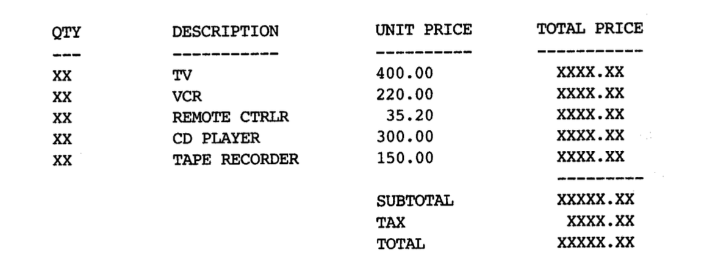

# Lab 2:  Strings, Operators, & Expressions

Welcome to the second CSC 200 lab! This will will familiarize you with Strings, Operators, and Expressions, as well as give you some experience in their proper use. **Be sure to read and follow all instructions unless otherwise specified.**  You'll find the table of contents for this lab below.

1. [Strings](#part-1-strings)
4. [Operators and Expressions](#part-2-operators-and-expressions)
3. [Exercises](#part-3-exercises)

## Part 1. Strings

One of the most useful data types supplied in the C++ libraries is the string. A string is a variable that stores a sequence of characters, such as **"Hello"** or **"May 10th is my birthday!"**. Just like the other data types, to create a **string** we first declare it, then we can store a value in it.

`std::string testString;`

`testString = "This is a string.";`

We can also combine these two statements into one line, if we know the value we wish to store at the time of the variable instantiation:

`std::string testString = "This is a string.";`

Often, we use strings as output, and **cout** works exactly like one would expect:

 `std::cout << testString << std::endl;`

Which will print the same output as:

`std::cout << "This is a string." << std::endl;`

In order to use the string data type, the **C++** string header `<string>` must be included at the top of the program. Thus, you would have the following `#include` at the top of your program in order to use the **string** type.

 `#include <string>`

Let’s go into specifics about the string manipulations you’ll be doing the most.

### Note: You should view each of the below mentioned functions on the C++ Reference Site! [Here is the link for the `string`class page.](https://www.cplusplus.com/reference/string/string/)

* **Erase a part of string**

  The **C++ string library** allows you to erase a part of a string using the `erase()`function. The function works differently according to the parameters passed.

  * `erase()`

    will erase the complete string.

  * `erase(position)`

    will delete all the characters after the specified index

  * `erase(index, length)`

    will delete the specified number (length) of characters after the specified index

* **Counting the number of characters in a string**

  The `length` method returns the number of characters in a string, including spaces and punctuation. Like many of the string operations, length is a *member function*, and we invoke member functions using *dot notation*. 

  The string object that the function will act upon is to the left of the dot, the member function we are invoking is to the right, (e.g. **`str.length()`**). In such an expression, we are requesting the length from the variable str.

* **Searching within a string**

  The string member function **find** is used to search within a string for a particular string or character. A sample usage such as **`str.find(key)`** searches the string object **str** for the value of **key**. The parameter **key** can either be a string or a character. (We say the **find** member function is *overloaded* to allow more than one usage). The return value is either the starting *position* where the key was found or the constant **`string::npos`** which indicates the key was not found.

* **Modifying a string by inserting and replacing**

  Finally, let’s cover two other useful member functions that can modify a string object. 

  * The first, **`str1.insert(start, str2)`**, inserts str2 at position start within str1, shifting the remaining characters of str1 over. 

  * The second, **`str1.replace(start, length, str2)`**, removes from str1 a total of length characters starting at the position start, replacing them with a copy of str2. It is important to note that these member functions do modify the string object they act upon.

  

* **Appending to a string**

  C++ strings are wondrous things. Suppose you have two strings, **s1** and **s2** and you want to create a new string of their concatenation. Conveniently, you can just write **`s1 + s2`** and you’ll get the result you’d expect. Similarly, if you want to append to the end of string, you can use the **`+=`** operator. You can append either another string or a single character to the end of a string.

  

* **Converting Strings**

  Sometimes we may need to convert the data in a string to a numerical data type (`int`, `float`, etc.) or vise versa.

  The `<string>` library provides methods for these as well!

  [Take a look at the `<string>` library page this time to familiarize yourself with these functions](https://www.cplusplus.com/reference/string/) They will come in extremely useful throughout the semester!

## Part 2. Operators and Expressions

As you know from your readings/videos, **expressions** perform a series of **operations**, and **operators** act upon variables & values. Without them, we wouldn't be able to do very much programming.

While they are fairly simple to comprehend (`=` performs assignment, `+` performs addition, `-` performs subtraction, etc.) there are some nuances you should be aware of.

Much like how Mathematics has an **order of operations (PEMDAS)**, so does programming! Each language defines their own **operator precedence** that dictates how an expression is evaluated.

[Take a moment to view the C++ Operator Precedence table](https://en.cppreference.com/w/cpp/language/operator_precedence) so that you better understand how expressions are evaluated. This will help you to not make mistakes, as well as assist in tracking down bugs in your calculations.

## Part 3. Exercises

1. Let’s say we have a sentence and we want to define that as a string variable in c++. 

```c++
std::string sentence = “C++ is a high-level x-oriented programming language that helps programmers write fast, yyytable programs”
```

  + Find the location of x (using `find()` ) in the sentence
  + Define a new `string` object `fill_x` that contains the string-literal `"object"`. Use the `insert()` function to replace the letter `'x`' in `sentence` with the contents of `fill_x`. 
         + After execution, `sentence` should look like this: `“C++ is a high-level object-oriented programming language that helps programmers write fast, yyytable programs”`
  + Repeat the procedure to replace `"yyytable"` with `"portable"`. 
         + After execution, `sentence` should look like this: `C++ is a high-level object-oriented programming language that helps programmers write fast, portable programs.”`
  + Define another `string` object `concat` that contains the string-literal `"“C++ provides rich library support in the form of standard template library.”`. Use the `+` operator to concatenate this string to the end of  `sentence`.
    		+  + Note: This will combine the strings, but there will be no space between them. How can we fix this?
 + Use the `erase()` function to remove all commas from `sentence`.
+ Output the length of the final version of `sentence`.

 2. Write a program to create a customer’s bill for a company. The company sells only five different products: TV, VCR, Remote Controller, CD Player and Tape Recorder. The unit prices are $400.00, $220, $35.20, $300.00, and 	$150.00, respectively. The program must read the quantity of each piece of equipment purchased from the keyboard. It then calculates the cost of each item, the subtotal, and the total cost after a 8.25% sales tax. The input data consist of a set of integers representing the quantities of each item sold. These integers must be input into the program in a user friendly way; that is, the program must prompt the user for each quantity as shown below. The numbers in boldface show the user’s answers.

    - How Many TVs Were Sold? **3**
    - How Many VCRs Were Sold? **5**
    - How Many Remote Controllers Were Sold? **1**
    - How Many CDs Were Sold? **2**
    - Haw Many Tape Recorders Were Sold? **4**

    The output should be neatly formatted, and look something like this:

    

### Requirements

1. Exercise 1 completed.
2. Exercise 2 completed.
