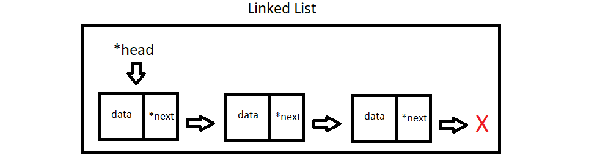
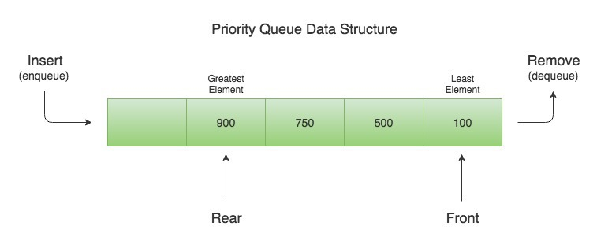

# Lab 5 - Priority Queues!

### Background Info

Priority Queues are a special form of queue that allow for "cutting in line". This is beneficial when you want to want to enforce a FIFO (first in first out) ordering schema while also allowing more important entries to have priority.

#### Linked List

We'll be using Linked Lists as our base today. We are familiar with the Node & LinkedList classes as well as how they behave together from Lab 4.

Node objects store Data & a reference to the next Node in the list. The LinkedList maintains a pointer to the first Node in the list ("head") and contains all of the operations that can be performed on the list. LinkedLists can also contain a "tail" pointer that points to the last element in the list.

  

#### Queue

As a refresher, a Queue is a Linked List with an enforced add/remove order: first-in first-out (FIFO). Elements added to the Queue (enqueued) are placed at the back, and we can only ever remove (dequeue) from the front.

  

  How is this different from a stack? Remember stacks function like a stack of pancakes where to eat a pancake the top one is pulled off - not the bottom pancake - not the middle one. To add more pancakes on the stack, you place them on the top.
  > If you don't eat your pancakes this way please disregard this analogy; and maybe seek help.

  Try to come up with a real world example of a queue with your group and write it as a comment on the top of your main file.

#### Priority Queue

As you may suspect, a priority queue's roots lies in the Queue data structure, which we have previously seen as a special Linked List.

  

The Priority Queue has the same properties as the Queue in addition to the following:

- Every element has an associated priority
- Elements with a high priority are dequeued before an element with a lower priority
- Any elements with matching priorities are dequeued in the order they arrived

Lets compare the performance of a Queue with a Priority Queue:

|         | Queue | Enqueue |
| :-----: | :---: | :-----: |
| Enqueue | O(1)  |  O(n)   |   <----
| Dequeue | O(1)  |  O(1)   |
|  Peek   | O(1)  |  O(1)   |

They are very similar, but Enqueue jumps from a constant time operation to a linear time operation. Yikes!

**Why might this be?**

    
Click here to reveal the answer!

    To insert elements into a P-Queue, we must iterate over the queue until we find the proper location. Worst cast would be adding an element with the lowest priority, so we would need to traverse the entire list.

But fret not, there is a better way to implement a Priority Queue! 

#### Heaps  

Re-implement your Priority Queue using the Heap structure covered during yesterday's lecture. Refer to those lecture notes to help you!!

---

### Your Task

You are given code for a working Linked List in the "lab 3 solution" folder and are tasked with modifying it to be a Queue, then a Priority Queue.

---

1. Go through **all** of the classes & functions you will need to change and write comments explaining what needs changing for both problems.
   - Reading through the code first and modifying it second will save you lots of time and confusion! See what you are working with before totally rewriting functions that are already there.

2. Convert the Linked List code into a Queue class (you will not need every linked list member function reimplemented in the queue class). Create some simple test cases in your main file to run the member functions on your queue object - show FIFO is enforced.
   - The bulk of the work will be in ensuring you have a enqueue function that will push a new element to the back of the queue (top) and a dequeue function that will remove an element from the front of the queue (bottom) and return it.
   - You should also implement a peek function that will return the head element (front-most element) so it can be examined but not removed.

3. Copy the code for your Queue program into another folder and convert it into a Priority Queue. Once more, create test cases in your main file to show it works properly.
   - The hint for adding the priority queue functionality is to add a priority variable to the node class. In this way the queue can check each node object's priority value for comparisons when pushing things onto the queue
4. Apply the concept of a heap to create a more efficient version of a priority queue.

Submit all of the files for this Lab to Gradescope upon completion/lab end.
